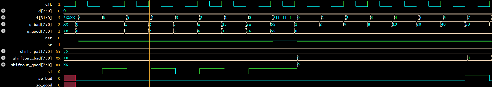

# DFT Projects — VLSI Design for Testability
> Self-directed portfolio targeting semiconductor internships.  
> Tools: EDA Playground · Icarus Verilog

---

## ✅ Project 1 — Scan Chain + Fault Injection
**Concepts:** Scan design, shift-capture-shift, SA1 fault detection  
**Tools:** Verilog, EDA Playground, Icarus Verilog 12.0

### What this demonstrates
- Designed a scan-enabled DFF with SE-controlled 2:1 MUX
- Chained 8 scan FFs and verified full shift→capture→shift cycle
- Injected SA1 fault on d[0] (wire shorted to VDD)
- Proved fault is invisible during scan shift-in but detected
  after capture phase — exactly how ATE detects manufacturing defects

### Fault injection results
| | Fault-free | SA1 on d[0] |
|---|---|---|
| Capture response | `00000000` | `00000001` |
| Shift-out | `00000000` | `00000001` |
| **Result** | — | **DETECTED ✓** |

---

## 🔄 Project 2 — ISCAS-85 Fault Simulator *(coming soon)*
## 🔄 Project 3 — LFSR + MISR Logic BIST Core *(coming soon)*
## 🔄 Project 4 — DFT-Aware 4-bit ALU *(coming soon)*
